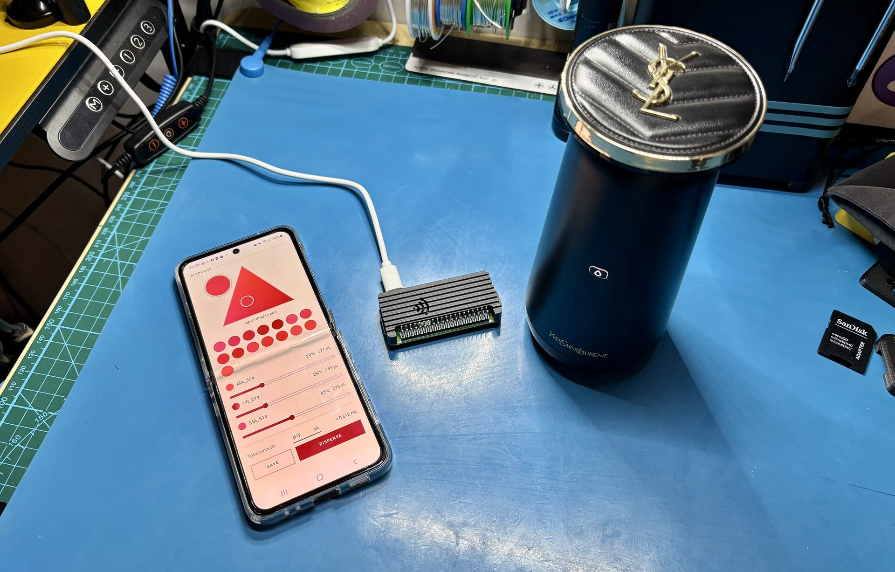
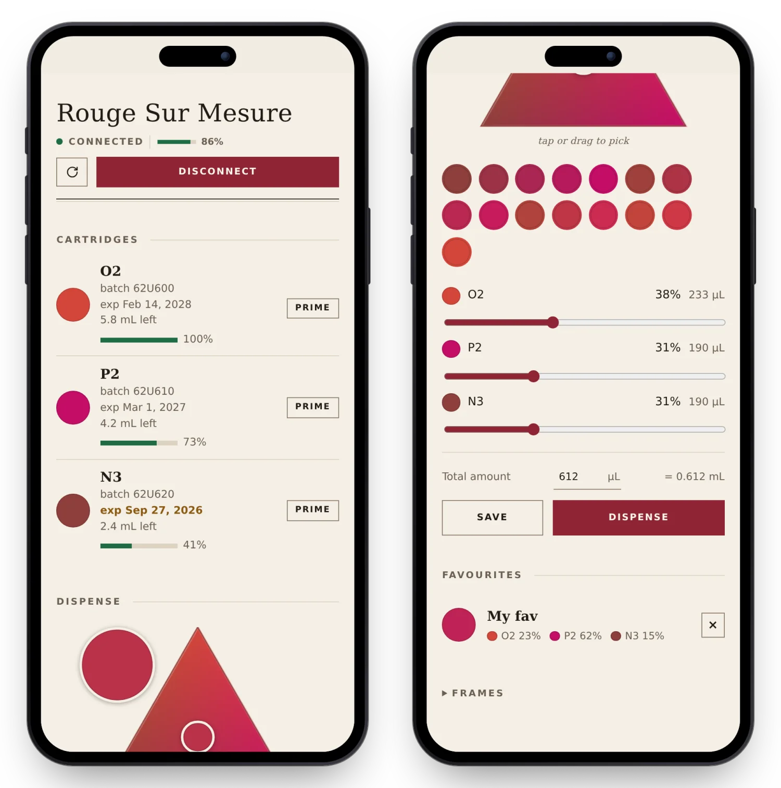

# Reverse engineering the YSL Rouge Sur Mesure

YSL/L'Oréal sold the *Rouge Sur Mesure*, a lovely little machine that mixes
three colour cartridges into custom lipstick, then discontinued it on
1 February 2026. The problem is that the hardware is useless without the official
phone app, and the app itself now greets you with a warning that it will be
kept alive for just 3 more years, with no updates or fixes in the meantime,
and nothing says a frozen app will survive whatever Android or iOS versions
ship before that deadline. So by February 2029 at the latest, plenty of
people, my girlfriend included, will own a perfectly healthy device turned
paperweight by a dead app.

This project replaces the app with a **local web app** that speaks the same BLE
protocol the device already expects, so assuming you have cartridge stock, you
can keep using the machine indefinitely. The firmware is fine, only the
phone-side software is rotting. We use the official cartridges, so there is no
cartridge auth or colour science to break, just reproduce the app's side of the
conversation. The protocol is fully worked out, from a capture of the real app
plus the decompiled native SDK.

Bonus: it unlocks combinations the app was jailing. The app only allowed
specific cartridges to be used together, here any three cartridges can be
loaded and mixed, which opens up far more colours than the official catalogue
ever did.

Here is the device with a Raspberry Pi Zero serving the control page over its
own wifi hotspot, and a phone connected to it controlling the device, see
[Standalone box (Pi Zero W + hotspot)](#standalone-box-pi-zero-w--hotspot).



And the new control panel itself, it monitors the cartridges and the device
battery, and lets you mix a colour, dispense it straight from the browser, and
save blends as favourites to reuse later.



## Quick start

In order:

```sh
make venv            # 1. create .venv and install bleak
make scan            # 2. find your device's BLE address
cp .env.example .env # 3. then set RSM_ADDRESS in it (from make scan)
make pair            # 4. bond with the device, once per machine (wake it first)
make web             # 5. control page -> http://127.0.0.1:8765
```

For development only:

```sh
make test            # run the offline test suite (pytest)
make mock            # control page against a simulated device, no hardware needed
```

The device's BLE address isn't stored in the repo, put it in a local `.env`
(copy `.env.example`), which the Makefile loads, so `make web` / `make dispense`
pick it up with no extra flags. The device has no useful name, but it advertises
a distinctive manufacturer ID (`0xface`) that nothing else around does, so
`make scan` picks it out of the crowd and prints the ready-to-use
`RSM_ADDRESS=` line to paste in. If it doesn't show (it only advertises while
awake), run `python re_tools/enumerate.py wake`, which scans before and after you
open the lid and reports whichever device just woke up.

Wake the device (open the lid / press the button) before connecting, it stops
advertising when idle, and it accepts only one central at a time, so close the
phone app. It also insists on bonding (Just Works, no PIN) with every machine it
talks to and drops one that won't, refused it hangs up instantly, ignored the
Linux kernel's 30 s pairing timeout hangs up for it. `make pair` does the bond
once, it persists in BlueZ across reboots.

## The web app

`make web` serves the control page on `http://127.0.0.1:8765`. Run it on any
machine with a BLE adapter near the device, a laptop or a small always-on box
like a Raspberry Pi both work.

Once connected it auto-discovers which cartridges are loaded and their
colours, and from there you create a custom colour to mix, tune the amount per
cartridge, and dispense. The device pumps and blends the cartridges into a
little dose of lipstick which you then apply or store.

By default it binds localhost only, so it's reachable just from the machine it
runs on. To reach it from elsewhere on your home network, e.g. a Pi running the
server that you open from your laptop, set `RSM_LAN=1` in `.env`:

```sh
# in .env
RSM_LAN=1
```

Then `make web` and open `http://raspberrypi.local:8765` (the Pi's hostname),
or its IP.

That binds all interfaces. Requests are still only accepted when addressed to
the machine itself, by hostname, `hostname.local`, or whichever of its IPs the
browser connected to (a Host-header check that blocks DNS-rebinding, nothing to
configure when the IP changes). There is no login, treat the page as
trusted-LAN only, anyone who can reach the address can drive the pumps. On an
untrusted network, prefer an SSH tunnel
(`ssh -N -L 8765:127.0.0.1:8765 pi@raspberrypi.local`) and leave it on
localhost.

### Run on boot (Raspberry Pi)

`pi/rsm.service` is a systemd unit that starts the server at boot. It reads
`RSM_ADDRESS` and `RSM_LAN` from the repo's `.env`, so set those there as
usual, then let `pi/setup.sh` install it (it fills in the user and paths,
turns Bluetooth on at boot, and keeps the journal in RAM to spare the SD card):

```sh
./pi/setup.sh                   # idempotent, rerun after changing .env or moving the repo
systemctl status rsm.service    # check it's up, journalctl -u rsm for logs
```

It stops cleanly on `systemctl stop` (the server disconnects the device first),
and restarts itself if it crashes.

### Standalone box (Pi Zero W + hotspot)

The device is meant to travel, so the controller should too. A Pi Zero W on a
USB power bank makes a self-contained kit: it broadcasts its own Wi-Fi
hotspot, so the phone or laptop connects to the Pi directly, anywhere, with no
home network, hotel Wi-Fi or internet involved. Setting `RSM_HOTSPOT_SSID`
and `RSM_HOTSPOT_PASSWORD` in `.env` makes `pi/setup.sh` add the hotspot and a
captive-portal redirect that opens the page on joining, on top of the boot
setup above. Flash Raspberry Pi OS Lite (32-bit for a Zero W), SSH in over
your home Wi-Fi, clone the repo, then:

```sh
cp .env.example .env   # RSM_ADDRESS, RSM_LAN=1, RSM_HOTSPOT_SSID/PASSWORD
./pi/setup.sh          # idempotent, rerun after changing .env
make pair              # once, with the device awake (bonds are per machine)
sudo reboot
```

After the reboot, join the hotspot: the phone shows a "sign in to network"
prompt that opens the page (a captive-portal redirect, `pi/portal.py`), and from
any browser `http://10.42.0.1` works too, as does `https://10.42.0.1` after
accepting the self-signed-certificate warning once. Other https addresses can't
be redirected, TLS doesn't allow interception. The Pi has
one radio, so while the hotspot is up it is off your home Wi-Fi: SSH to it
through the hotspot (`ssh pi@10.42.0.1`), and to update it hand the radio back
to NetworkManager, `git pull`, then `sudo reboot` to get the hotspot back:

```sh
sudo systemctl stop hostapd
sudo nmcli device set wlan0 managed yes
nmcli device wifi connect <home ssid>
```

Or push from the laptop instead of pulling: `make deploy` copies the checkout
over SSH to the Pi named by `RSM_PI` in `.env` (or `make deploy PI=pi@host`)
and restarts the app, `make deploy SETUP=1` also reruns `pi/setup.sh`. That
works over the hotspot (`pi@10.42.0.1`), the home network, or an ethernet
cable to the laptop: the Pi Zero has no address on the cable by itself, so let
the laptop hand one out once with
`nmcli connection modify "Wired connection 1" ipv4.method shared`, after which
`ip neigh` on the laptop shows the Pi's lease. Deploying writes over the
Pi's checkout, so pick one of `make deploy` and `git pull` for a given Pi.

The hotspot runs on hostapd rather than NetworkManager's own AP mode, which
cannot work on a Pi Zero W (it offers a key-management suite the firmware
leaves out of the beacon, so every client drops the handshake).

## Development

```sh
make test            # pytest
make lint            # ruff + black --check
make format          # ruff --fix + black
```

`make mock` runs the web app against `fake_device.py`, a simulated device that
answers the real frame protocol (status, cartridges, battery, dispense), so the
control page can be developed and tried without the hardware.

`protocol.py` is pure (no I/O), so frame building and parsing are unit-tested
against real captured frames in `tests/`. Dev tools (pytest, ruff, black) live
in `requirements-dev.txt`, installed on the first `make test`.

Layout: the web app lives at the repo root, `pi/` holds the Raspberry Pi
deployment (setup script, systemd units, captive portal), `re_tools/` the
reverse-engineering scripts and manual-testing tools, none of it needed to run
the web app. Generated dirs (`apk/`, `native/`, `decompiled/`, `.pylibs/`,
`tools/`, `.venv/`) and personal captures are gitignored and regenerate
locally.

## Legal

Nothing here was hacked or broken into. We own the device, it has no encryption
or authentication to bypass, and it runs on the official cartridges. This is
interoperability, working out how to make your own software talk to hardware you
own, which UK and EU law explicitly allows (the interoperability exception, UK
s50B CDPA, from the EU Software Directive), and a licence agreement can't take
that right away (s296A). Owning the device is what makes it allowed, not the
product being discontinued, the app stays copyrighted either way.

The one rule that comes with the exception is that the app's own code stays
private. So the decompiled output, the APK and the extracted native library are
never committed (`.gitignore` excludes them), only the protocol facts we worked
out from them, frame layouts, captured bytes, fitted cartridge colours, live in
this repo.

Not legal advice, and this is the UK/EU picture, the rules may differ where you
are and checking that is on you. This is meant for keeping a device you own
working, it's shared under the MIT [LICENSE](LICENSE) with no warranty, and what
anyone does with it, in any country, is their responsibility, not the author's.
